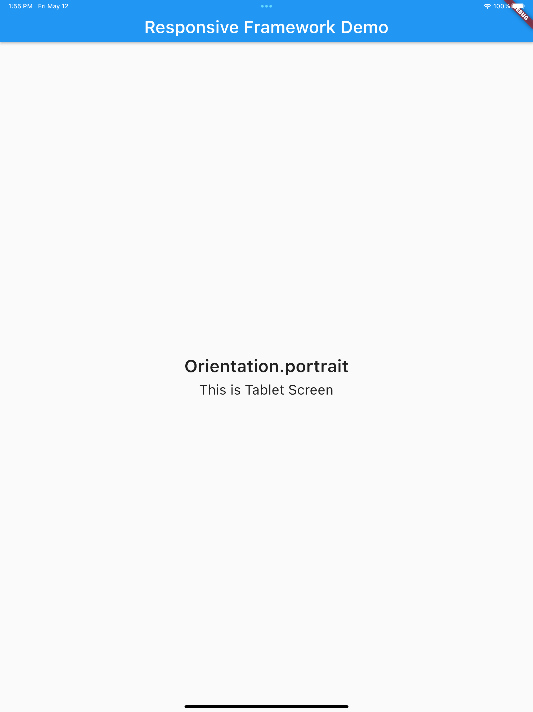
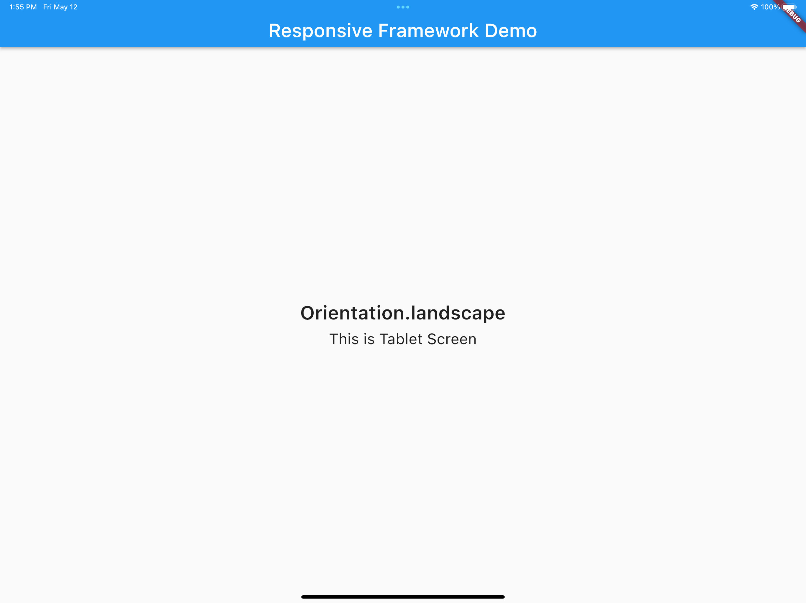
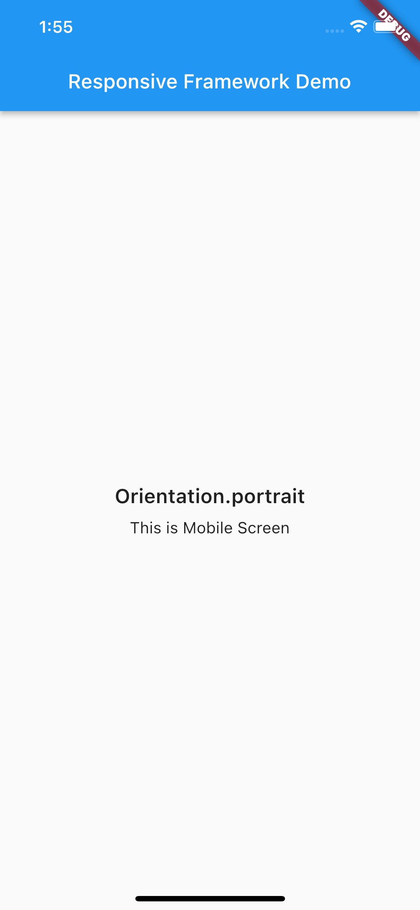
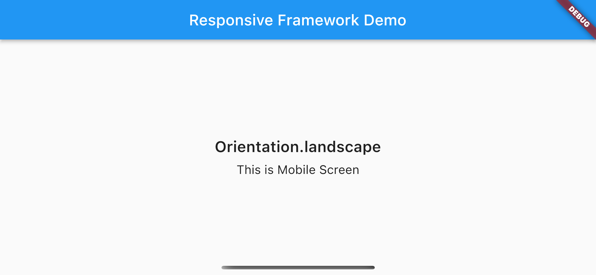

# Provide Widget for responsive Layout, Widget, and Text

<!-- 
. -->

## Tablet
 
 

<br>

## Mobile
 
 

<br>

# Installation
### Add responsive_framework to pubspec.yaml

```yaml
dependencies:
  responsive_framework: ^0.0.1
```
# Usage

## Import the Package
```dart
import 'package:responsive_framework/responsive_framework.dart';
```
## Wrap MaterialApp with ResponsiveUIWidget widget
```dart
ResponsiveUIWidget( 
  builder: (context, orientation, screenType) {
    return MaterialApp(
      home: HomePage(),
    );
  },
);
```

## Widget Size
```dart
Container(
  width: LayoutSizeHelper.h(50), // This will take 50% of the screen's width
  height: 30.h // This will take 30% of the screen's height
)
```

## Font size
```dart
Text('Responsive Framework', style: TextStyle(fontSize: 16.px))
```
or
```dart
Text('Responsive Framework', style: TextStyle(fontSize: FontSizeHelper.NORMAL_TEXT_MEDIUM))
```
### see FontSizeHelper for further detail

## Responsive UI Helper Class provide custom Responsive Widget
```dart
ResponsiveUIHelper.buildTitleTextWidget(titleText);
```
```dart
ResponsiveUIHelper.buildNormalTextWidget(text);
```
```dart
ResponsiveUIHelper.buildPlatformWidget(
    tabletWidget: YourTabletWidget(),
    mobileWidget: YourMobileWidget(),
);
```
```dart
ResponsiveUIHelper.buildPlatformWidgetWithOrientation(
    tabletPortraitWidget: YourTabletPortraitWidget(),
    tabletLandScapetWidget: YourTabletLandScapeWidget(),
    mobilPortraitWidget: YourMobilePortraitWidget(),
    mobilLandScapeWidget: YourMobileLandScapeWidget(),
);
```